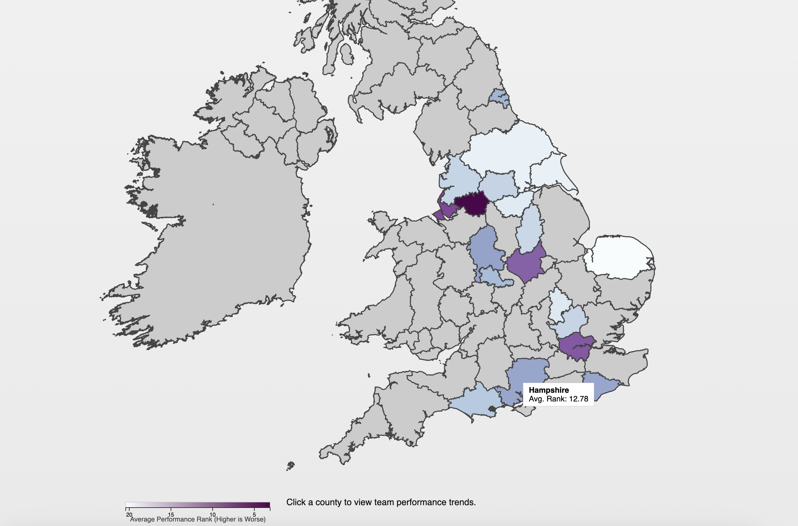
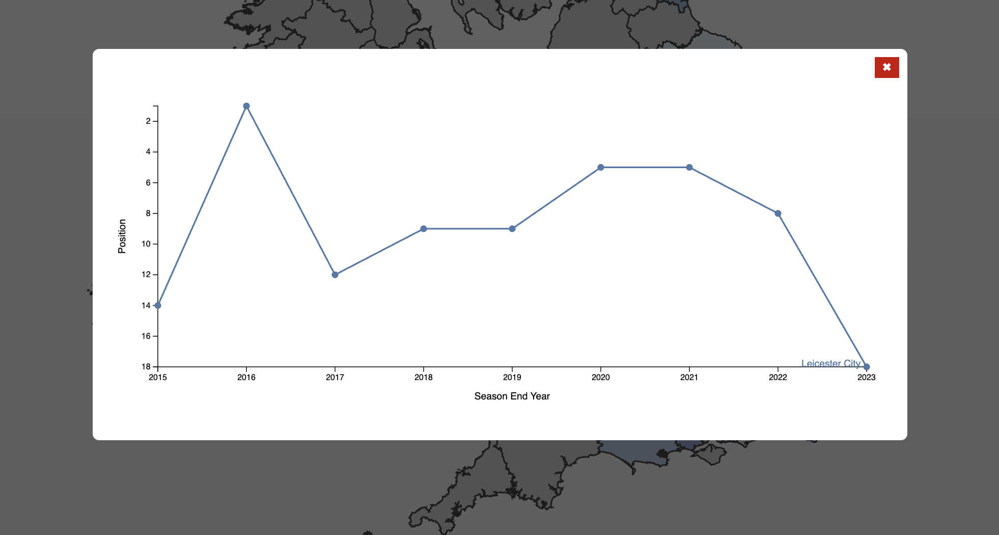

# 📊 UK Football Performance Visualizer (2005–2024)

This project analyzes and visualizes football performance across ceremonial counties in the UK between 2005 and 2024. It provides an interactive HTML-based interface for exploring data such as win/loss ratios and team distributions, using GeoJSON for geographic mapping.




## 📁 Project Structure

shayan.bali/

├── Shayan_Bali_Report.pdf # Final report detailing methodology and results

├── Shayan_Bali_Demo.MP4 # Demonstration video showing tool in action

└── code/

    ├── index.html # Main visualization interface
  
    └── ceremonial_counties.geojson # GeoJSON file for UK ceremonial counties
  
└── data/

    ├── pl_record.csv # Premier League team performance data
  
    └── performance_by_county.csv # Aggregated performance data by county


## 🚀 Features

- Interactive web-based visualization using HTML and JavaScript
- Performance metrics for Premier League teams mapped by UK region
- Trend charts for each county by clicking on them

## 🗺️ Data Sources

- The `pl_record.csv` and `performance_by_county.csv` files are custom processed data about football performance.
- The `ceremonial_counties.geojson` file defines the boundaries of UK counties for visual rendering.

## 📽️ Demo

You can view a walkthrough of the tool in the [Shayan_Bali_Demo.MP4](./shayan.bali/Shayan_Bali_Demo.MP4) file.

## 📘 Report

For a detailed explanation of the methodology and insights, refer to the [Shayan_Bali_Report.pdf](./Shayan_Bali_Report.pdf).

## 🌐 How to Run

1. Clone this repository:
    ```bash
    git clone https://github.com/your-username/uk-football-visualizer.git
    ```

2. you can run a local server:

    Using Python 3:
    ```bash
    cd uk-football-visualizer/code
    python3 -m http.server
    ```

## 📄 License

This project is for educational and research purposes. Contact the author for reuse.

---

👤 Developed by **Shayan Bali**
